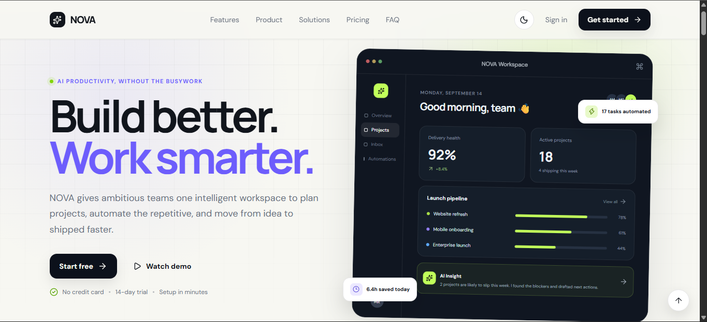
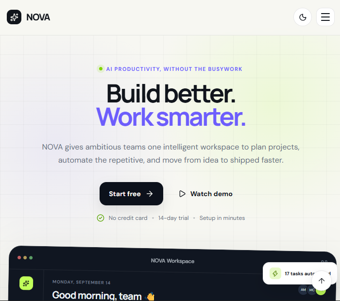
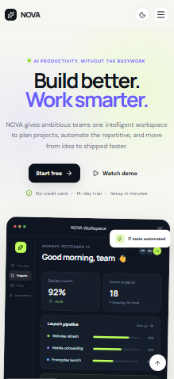

# NOVA — AI Productivity Platform

> **Build Better. Work Smarter.**

NOVA is a modern AI-powered productivity platform designed to help teams manage projects, automate repetitive workflows, and collaborate more efficiently.

This project was developed as a front-end development assignment to demonstrate modern UI/UX design, responsive web development, React component architecture, interactive functionality, and accessibility practices.

---

## 🚀 Live Demo

<<<<<<< HEAD
**Live Demo:** `https://nova-jade-sigma.vercel.app/`
=======
**Live Demo:** `https://YOUR-VERCEL-URL.vercel.app`
>>>>>>> a479632e6f237a8910dd202b7af7350e3feb085e

> Replace the URL above with the deployed Vercel/Netlify URL after deployment.

## 📂 GitHub Repository

**Repository:** `https://github.com/Rathii007/nova_landingPage`

---

# ✨ Features

The landing page includes all required sections from the assignment:

* Responsive navigation bar
* Mobile hamburger navigation
* Hero section with primary CTA
* Trusted-by company logos
* Feature section with 6+ features
* Product / About section
* How It Works section
* Statistics section
* Solutions / Use Cases
* Testimonial section with 3+ testimonials
* Pricing section with 3 pricing plans
* FAQ section with 5+ questions
* Final CTA
* Footer
* Newsletter signup validation

### Interactive Features

* Smooth scrolling navigation
* Responsive mobile menu
* FAQ accordion
* Button hover animations
* Feature and pricing card hover effects
* Light / dark mode
* Monthly / annual pricing toggle
* Testimonial carousel
* Demo modal
* Scroll reveal animations
* Animated statistics
* Back-to-top button
* Newsletter form validation

---

# 🛠️ Technologies Used

### Frontend

* **React**
* **Vite**
* **JavaScript (ES6+)**
* **HTML5**
* **CSS3**

### UI / Design

* Responsive CSS
* CSS animations and transitions
* Modern card-based UI
* Semantic HTML
* Responsive layout techniques

### Development Tools

* Git
* GitHub
* VS Code
* npm

### AI-Assisted Development

AI tools were used during development for brainstorming, implementation assistance, debugging, content generation, and code review.

* ChatGPT

AI-generated code was reviewed, modified, tested, and integrated manually rather than being submitted without understanding the implementation.

---

# 📦 Installation

## Prerequisites

Make sure you have the following installed:

* Node.js 18+
* npm
* Git

## Clone the repository

```bash
git clone https://github.com/Rathii007/nova_landingPage.git
cd nova_landingPage
```

## Install dependencies

```bash
npm install
```

## Start the development server

```bash
npm run dev
```

The application will normally be available at:

```text
http://localhost:5173
```

## Create a production build

```bash
npm run build
```

## Preview the production build

```bash
npm run preview
```

---

# 🖼️ Screenshots

Add screenshots of the application here after deployment.

### Desktop



### Tablet



### Mobile



> Create a `screenshots` folder in the repository and add the corresponding images.

---

# 🧩 Component Structure

The application uses reusable React components to keep the UI modular and maintainable.

A simplified structure is:

```text
src/
├── main.jsx
├── styles.css
└── components/
    ├── Navbar
    ├── Hero
    ├── TrustedBy
    ├── Features
    ├── Product
    ├── HowItWorks
    ├── Statistics
    ├── Solutions
    ├── Testimonials
    ├── Pricing
    ├── FAQ
    ├── CTA
    └── Footer
```

The page is divided into independent UI sections rather than placing the entire interface into one large component.

Repeated content such as:

* Features
* Pricing plans
* Testimonials
* FAQs
* Solutions

can be represented using JavaScript data structures and rendered dynamically.

This reduces duplication and makes future content changes easier.

---

# 🎨 Design Decisions

The design follows a modern SaaS/productivity-platform visual language.

### Visual Style

The interface uses:

* Large typography for strong hierarchy
* Rounded cards and containers
* Generous spacing
* Clear CTA buttons
* Subtle shadows and borders
* Smooth transitions and hover states
* Responsive layouts for different screen sizes

The goal was to make NOVA feel like a real commercial SaaS product rather than a basic tutorial landing page.

### Color and Branding

The NOVA identity uses a clean modern palette with strong accent colors for CTAs and interactive elements.

Dark/light mode was also included to provide an additional layer of customization and improve usability across different viewing preferences.

### User Experience

The page follows a clear visual flow:

```text
Navigation
    ↓
Hero / Value Proposition
    ↓
Social Proof
    ↓
Features
    ↓
Product Overview
    ↓
How It Works
    ↓
Statistics
    ↓
Solutions
    ↓
Testimonials
    ↓
Pricing
    ↓
FAQ
    ↓
Final CTA
    ↓
Footer
```

This structure takes the visitor from awareness → product understanding → social proof → pricing → conversion.

---

# ⚛️ Technology Choice

## Why React?

React was selected because the assignment specifically recommends it and because it is well suited for building component-based interfaces.

React makes it easier to:

* Break the interface into reusable components
* Manage interactive UI state
* Render repeated content from data
* Maintain a clean component hierarchy
* Extend the application into a larger product later

For example, the FAQ section can maintain an active question state rather than relying on separate duplicated JavaScript logic for every question.

## Why Vite?

Vite provides:

* Fast development startup
* Fast Hot Module Replacement
* Simple React configuration
* Efficient production builds
* Minimal project setup

For a front-end assignment focused on a single-page application, React + Vite provides a lightweight and modern development environment.

---

# 📱 Responsive Design

The application was designed to work across:

* Desktop
* Laptop
* Tablet
* Mobile

Responsive layouts are implemented using CSS media queries, flexible containers, responsive typography, and adaptable grid layouts.

The navigation also changes behavior on smaller screens by switching to a hamburger menu.

Care was taken to prevent:

* Horizontal scrolling
* Overlapping sections
* Fixed-width elements breaking mobile layouts
* Text overflow
* Unusable touch targets

---

# ♿ Accessibility

Basic accessibility practices were incorporated throughout the interface.

Examples include:

* Semantic HTML elements
* Descriptive button labels
* Keyboard-accessible interactive controls
* Appropriate heading hierarchy
* Visible interactive states
* Accessible navigation controls
* Form labels and validation feedback

The application can be further improved with additional ARIA attributes, comprehensive keyboard testing, and automated accessibility auditing.

---

# ⚙️ Interactive Functionality

## Mobile Navigation

On smaller screens, the desktop navigation is replaced with a hamburger menu.

The menu visibility is controlled through React state, allowing the navigation to open and close without reloading the page.

## FAQ Accordion

Each FAQ item can be expanded and collapsed.

The selected FAQ is tracked using component state, allowing only the relevant answer to be displayed while keeping the interface compact.

## Pricing Toggle

The pricing section supports monthly and annual billing.

Changing the billing option updates the displayed pricing dynamically rather than requiring separate pages.

## Testimonial Carousel

Testimonials can be navigated interactively, allowing multiple customer quotes to be displayed within the same section.

## Demo Modal

The primary demo CTA opens a modal interaction rather than redirecting to a non-existent product page.

## Dark / Light Mode

The interface supports switching between light and dark visual themes.

The theme is applied dynamically to the page without requiring a refresh.

---

# 🧠 Challenges Faced

One of the main challenges was balancing a large number of required sections with a coherent visual hierarchy.

Simply adding every required section could easily result in a long, repetitive landing page. To address this, sections were grouped into a logical conversion flow and given different visual treatments.

Another challenge was ensuring that interactions such as:

* Navigation
* Accordion controls
* Pricing toggle
* Modal
* Carousel
* Theme switching

worked together without making the interface feel overly complicated.

Responsive behavior was also considered from the beginning rather than treating mobile support as an afterthought.

---

# 🤖 How AI Tools Were Used

AI tools were used as development assistants throughout the project.

ChatGPT was used for:

* Initial UI/UX brainstorming
* Landing-page content ideas
* Component planning
* React implementation assistance
* CSS implementation assistance
* Debugging and troubleshooting
* README/documentation preparation
* Reviewing possible improvements to accessibility and responsiveness

The generated suggestions were not blindly copied.

The implementation was reviewed and adapted to the requirements of the assignment, and the developer should be able to explain the React state management, component structure, responsive CSS, and interactive functionality used in the project.

AI was treated as a productivity tool rather than a replacement for understanding the code.

---

# 📈 Performance Considerations

The application is a lightweight front-end project with no large backend dependencies.

Performance considerations include:

* Minimal external dependencies
* Reusable components
* CSS-based animations
* Responsive layouts
* Avoiding unnecessary DOM complexity
* Vite production bundling

For a production version, additional improvements could include:

* Image optimization
* Lazy loading
* Code splitting
* Asset compression
* Lighthouse performance monitoring
* Further reduction of unused CSS/JavaScript

---

# 🔮 Future Improvements

A production version of NOVA could be extended with:

* Real authentication
* User dashboards
* Project management functionality
* AI task automation
* Real-time collaboration
* Backend APIs
* Database integration
* Payment processing
* Real newsletter backend
* Analytics
* Accessibility auditing and WCAG compliance improvements

The current landing page provides the front-end foundation for such a product.

---

# 👨‍💻 Author

**Mayank Rathi**

GitHub: [@Rathii007](https://github.com/Rathii007)

---

# 📄 Assignment

This project was created as part of a Front-End Development Assignment focused on:

* UI / Visual Design
* Responsive Design
* HTML / CSS
* JavaScript / React
* Component Architecture
* Functionality
* Accessibility
* Performance
* Code Organization
* Documentation
